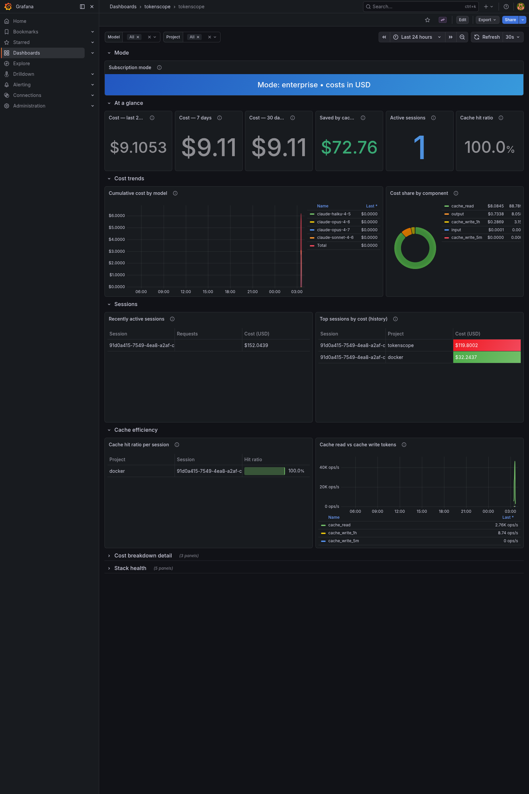

# tokenscope

A local-first observability tool for **Claude Code** usage and cost tracking.

tokenscope parses your local Claude Code session logs, computes token
usage and cost using current Anthropic pricing, and renders everything in
a single Grafana dashboard — including how much money you saved by using
prompt caching. **No prompt content, tool result bodies, or file contents
ever leave the host.** Only token counts, model identifiers, timestamps,
cache statistics, and session IDs are exported as metrics.



## Quick start

**Prerequisites:**
- Docker Desktop (macOS / Windows) or Docker Engine (Linux)
- Claude Code already installed and used at least once so
  `~/.claude/projects/` exists with `.jsonl` session files

```sh
git clone https://github.com/Quintin-John/tokenscope.git
cd tokenscope/docker
docker compose up
```

That's it. The stack:

| Service | URL / port | What it does |
|---|---|---|
| **Grafana** | <http://localhost:3000> (admin / tokenscope) | The dashboard you actually use |
| Collector | internal-only | Reads `~/.claude/projects/` and emits OTLP |
| OTEL Collector | internal-only | Receives OTLP, exposes a Prometheus scrape endpoint |
| Prometheus | internal-only | Scrapes and stores metrics |

Only Grafana is published to the host. The other services talk to each
other over an internal Docker network.

## What to look at first

Open **<http://localhost:3000/d/tokenscope/tokenscope>** (login: `admin` /
`tokenscope`). The dashboard has seven collapsible rows:

| Row | The question it answers |
|---|---|
| **At a glance** | "How much have I spent?" — 24h / 7d / 30d totals plus **Saved by caching** (the headline number) |
| **Cost trends** | "Where is the spend going over time?" — cumulative cost by model, share by component |
| **Sessions** | "What's running right now / what cost the most?" — active sessions table and historical top sessions |
| **Cache efficiency** | "Is my workflow benefiting from caching?" — hit ratio per session, read vs write split |
| **Cost breakdown detail** | _(collapsed)_ Deeper splits by model, daily trend with 7-day MA |
| **Stack health** | _(collapsed)_ Scrape status and OTLP throughput — only useful when something's wrong |

**Designed for dark theme.** If panels look washed out, switch via avatar
(top right) → Preferences → UI theme → Dark.

### The headline insight

The **Saved by caching** stat on the At-a-glance row shows the dollar
amount you would have paid if cache hits had been billed at full input
rate. Formula and derivation in
[`docs/metric-reference.md`](./docs/metric-reference.md#estimated-savings-from-caching).
On a typical Claude Code workload this number is often **5–10× your
actual monthly bill** — caching matters.

## Configuration

| File | What it controls |
|---|---|
| [`config/tokenscope.example.yaml`](./config/tokenscope.example.yaml) | Copy to `tokenscope.yaml` to override defaults. Path is auto-detected if you don't. |
| [`config/pricing.json`](./config/pricing.json) | Anthropic per-model rates. **Hot-reloadable** — edit while the stack is running and the collector picks up changes within a second. |
| [`.env.example`](./.env.example) | Compose-level overrides (Grafana password, polling toggle, Windows WSL2 note) |

Env vars with prefix `TOKENSCOPE_` override `tokenscope.yaml` values at
runtime. Convention: `TOKENSCOPE_<section>__<key>=value`. See
[`docs/architecture.md`](./docs/architecture.md#configuration-precedence)
for the full precedence rules.

## Validating `pricing.json` in CI

Before deploying a pricing config change, gate it through the collector's
built-in validator:

```sh
docker compose run --rm tokenscope-collector \
    --validate-pricing /data/config/pricing.json
```

Exits `0` on success, `4` on validation failure (errors on stderr), `2`
on file-not-found. No worker service starts — pure validation,
CI-friendly. Full details in
[`docs/troubleshooting.md`](./docs/troubleshooting.md#ci--scripting--validate-pricingjson-before-deploying).

## Common operations

**Stop the stack** (preserve all data):
```sh
docker compose down
```

**Stop and wipe all metric history**:
```sh
docker compose down --volumes
```

**Force a full re-scan** of session logs (forget where the collector left off):
```sh
docker compose down
docker volume rm tokenscope-state
docker compose up
```

**Tail the collector's logs**:
```sh
docker compose logs -f tokenscope-collector
```

## Development build (without Docker)

```sh
dotnet restore
dotnet build
dotnet test
```

Requires the .NET 8 SDK (pinned via [`global.json`](./global.json)). The
.NET workflow is for working on the code itself; for using tokenscope as
a tool, the Docker stack is the supported path.

## What's tracked, and what's not

**Tracked:**
- Claude Code (CLI / `claude` command) session logs from `~/.claude/projects/`
- Token usage by component (input / output / cache read / cache write 5m / cache write 1h)
- Cost in USD, computed from token counts × current Anthropic rates in `config/pricing.json`
- Cache efficiency (hit ratios, write/read ratios, estimated savings)
- Session and project metadata (UUIDs, `cwd`-derived project names)

**Not tracked:**
- **claude.ai web / desktop conversations.** Those are stored
  server-side; they don't appear in `~/.claude/projects/` and there's
  no local file to parse. Capturing them would require the Anthropic
  Admin API (Enterprise plans only) — deliberately out of v0.1.0 scope
  per CLAUDE.md (Claude Code local logs only).
- **Anthropic API calls from your own apps.** If you're calling the
  Anthropic API directly (e.g., from a Python script with the
  `anthropic` SDK), those calls don't go through Claude Code and
  aren't logged to `~/.claude/projects/`. Different scope.

If you split work between Claude Code and claude.ai web/desktop,
tokenscope's numbers will be an under-count of your full Claude bill.
The dashboard banner makes this explicit.

## Troubleshooting

See [`docs/troubleshooting.md`](./docs/troubleshooting.md). Common
issues addressed up front: permission-denied on log reads, dashboard
shows no data, file-watcher events not firing on macOS, port conflicts,
Windows WSL2 path resolution, Grafana credentials.

## License

[MIT](./LICENSE)
